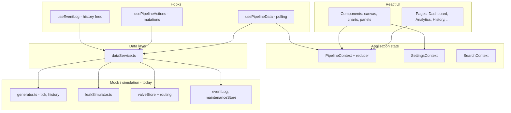
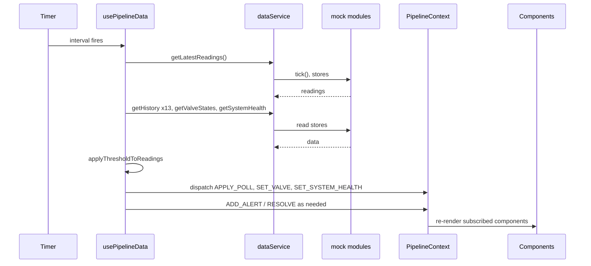

# Water Leakage Monitoring Dashboard — Code Flow Overview

This document explains **how the application is structured and how data moves from simulation to the screen**, for stakeholders who need a technical overview without reading every file.

---

## 1. Purpose and scope

The product is a **React + Vite** web dashboard for a water pipeline digital twin: **13 pipes**, **3 reservoirs (A, B, C)**, **valves**, and **flow sensors** (one per pipe). Hardware is not required for the current build: **all readings are simulated** in the browser. The architecture is intentionally shaped so that **replacing mock data with a real backend** (for example InfluxDB via a REST API) is confined to a **single integration point** (`src/services/dataService.ts`).

---

## 2. Technology stack

| Area | Choice |
|------|--------|
| UI | React (TypeScript), Vite |
| Styling | Tailwind CSS + design tokens (`src/styles/tokens.css`) |
| Charts | Recharts |
| App state | React Context + `useReducer` (pipeline), plus small contexts for settings and search |
| Routing | React Router |
| Icons | Lucide React |

---

## 3. End-to-end architecture

The guiding rule is a **data boundary**: UI code works with typed **pipeline state** and **hooks**; it does not talk to mock modules directly.

**Migration note:** To connect real sensors later, you implement the same `DataService` interface in `dataService.ts` and point it at your API. Components and most hooks can stay unchanged.

---

## 4. Application bootstrap

1. **`index.html`** loads the React root.
2. **`src/main.tsx`** mounts the app and imports global styles (tokens + Tailwind).
3. **`src/App.tsx`** wraps the tree with providers and defines routes:

   - **`PipelineProvider`** — live sensor history, valves, alerts, system health.
   - **`SettingsProvider`** — flow threshold, poll interval, display units (in memory only).
   - **`SearchProvider`** — shared search query for filtering lists in the UI.

4. **`BrowserRouter`** routes render inside **`AppLayout`**, which is the main shell (navigation, header, content area).

---

## 5. Where live data is “turned on”

**`AppLayout`** renders a tiny child **`PipelineDataHost`** that only calls **`usePipelineData()`**. That hook is **not** used inside random leaf components; it lives once at the layout level so **every route** shares the same polling loop and pipeline state.

If the pipeline context reports an error, the layout shows a **global error banner** at the top.

---

## 6. The data service (single integration surface)

**`src/services/dataService.ts`** is the **only** module that imports from **`src/mock/`**. It exports one object implementing **`DataService`** (see `src/types/pipeline.ts`).

Responsibilities include:

| Capability | Role in the app |
|------------|------------------|
| `getLatestReadings()` | One simulation step; returns current flow (and related fields) for all sensors |
| `getHistory()` | Rolling history per sensor for charts |
| `getValveStates()` | Valve open/closed positions for the SVG |
| `setValveState`, `setPumpOn`, `setRoutingMode`, `isolatePipe` | Simulated SCADA-style actions |
| `getSystemHealth()` | KPIs such as pump state and filter health (mock) |
| `getMaintenanceMeta`, `acknowledgeSensor`, `markReplaceSensor` | Maintenance table metadata |
| `getEventLog()` | Timeline of alerts, valve actions, routing changes |
| `simulateLeak` / `clearLeak` | Developer-style leak testing on a pipe |

All async methods return **Promises** so a future real implementation can use `fetch` without changing callers.

---

## 7. Mock simulation (how numbers are produced)

Roughly each poll interval:

1. **`generator.tick()`** advances the simulation: generates flow (and derived pressure for maintenance views), applies **valve and routing rules**, appends to per-sensor history buffers, and returns the latest reading map.
2. **`leakSimulator`** marks which pipes are in “leak” mode when you use the leak simulator UI; those pipes get **low flow** instead of normal band.
3. **`valveStore`** and **`routingSimulation`** adjust how flow is distributed in the mock network when valves or routing modes change.

Constants (pipe IDs, thresholds, layout-related numbers) live in **`src/config/pipeline.ts`**. Shared types live in **`src/types/pipeline.ts`**.

---

## 8. Polling loop: `usePipelineData`

**`src/hooks/usePipelineData.ts`** runs on an interval from **`SettingsContext`** (`pollIntervalMs`, default aligned with project config).

On each tick it:

1. Calls **`dataService.getLatestReadings()`** and **`getHistory()`** for each sensor.
2. Calls **`dataService.getValveStates()`** and **`getSystemHealth()`**.
3. Applies **`applyThresholdToReadings()`** (`src/utils/flowStatus.ts`) so **flow status** (normal / warning / critical) reflects both the raw reading and the **user-adjustable minimum normal flow** from settings.
4. Dispatches **`APPLY_POLL`** to merge sensors, history, and timestamp; updates valves and system health.
5. Compares each sensor’s status to the **previous** poll: transitions **into** critical flow raise **alerts**; transitions **out** of critical resolve alerts for that pipe.

Changing the threshold slider re-applies classification to the **current** readings without waiting for the next tick (separate `useEffect`).

---

## 9. Pipeline state: `PipelineContext`

**`src/context/PipelineContext.tsx`** holds **`PipelineState`**: sensors, history, valves, system health, alerts, loading and error flags, and `lastUpdated`.

Updates go through a **reducer** with actions such as `APPLY_POLL`, `SET_VALVE`, `SET_SYSTEM_HEALTH`, `ADD_ALERT`, `RESOLVE_ALERTS_FOR_PIPE`, etc.

Any component under **`PipelineProvider`** can call **`usePipelineContext()`** to read this state.

---

## 10. User actions that change the “plant”

**`src/hooks/usePipelineActions.ts`** wraps **`DataService`** mutations (valves, pump, routing, isolation, maintenance acknowledgements) and updates context where needed. **Components should use this hook** instead of importing `dataService` directly, so behavior stays consistent and easy to mock or extend.

Examples:

- Closing a valve or running **pipe isolation** updates the mock store, then refreshes valve state in context.
- **Pump on/off** refreshes **system health** in context after the service call.

---

## 11. Main UI surfaces (routes)

| Route | Purpose |
|-------|---------|
| **`/` (Dashboard)** | SVG **pipeline canvas** (pipes, reservoirs, sensors, valves), **flow chart**, **alerts**, **system health**, **leak simulator** |
| **`/analytics`** | Broader charts and exports using context history / alerts |
| **`/history`** | **Event log** (via `useEventLog`, backed by mock event store) |
| **`/maintenance`** | Per-sensor table, acknowledgements, replacement flags |
| **`/settings`** | Threshold, poll interval, flow unit display |
| **`/event/:alertId`** | Detail view for a specific alert |

**`AppHeader`** / **`AppNav`** provide navigation and KPI-style summary using pipeline state and search.

---

## 12. Domain model (short)

- **Pipes:** IDs `1`–`13` with defined connectivity (see `ARCHITECTURE.md` and `pipeline.ts`).
- **Sensors:** ID pattern `S{pipeId}` (e.g. `S7` on pipe 7).
- **Valves:** Identifiers such as `VB`, `VC`, junction valves — positions on the SVG come from config.
- **Flow status:** Derived from flow rate and configurable “minimum normal” threshold; **warning** and **critical** bands use shared constants in config.

---

## 13. Summary diagram: one poll cycle

---

## 14. Files to read first (for developers)

| File | Why |
|------|-----|
| `src/services/dataService.ts` | Backend swap point |
| `src/hooks/usePipelineData.ts` | Live polling and alerts |
| `src/context/PipelineContext.tsx` | Global pipeline state shape |
| `src/types/pipeline.ts` | `DataService`, `PipelineState`, domain IDs |
| `src/config/pipeline.ts` | Thresholds, pipe list, timing |
| `src/mock/generator.ts` | How one tick of data is built |

---

*This overview matches the repository as of the documentation date. For SVG coordinates and detailed pipe geometry, see `ARCHITECTURE.md`.*
